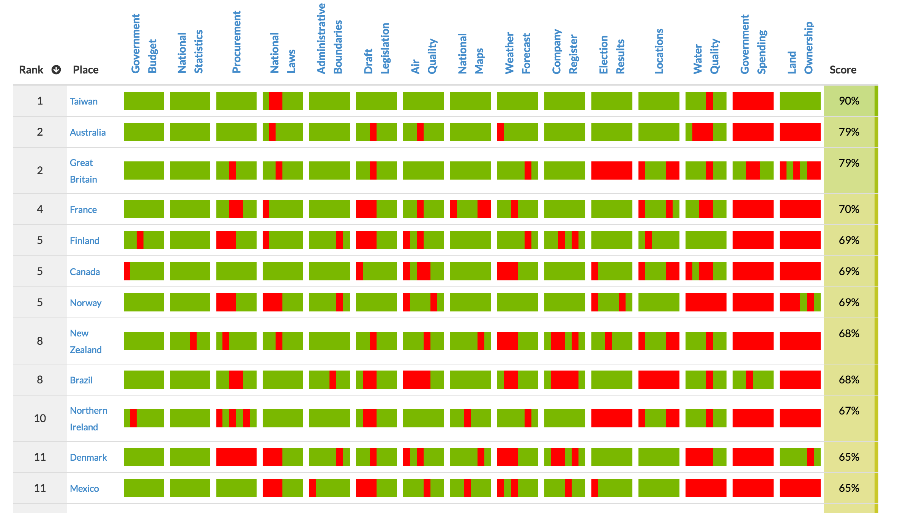
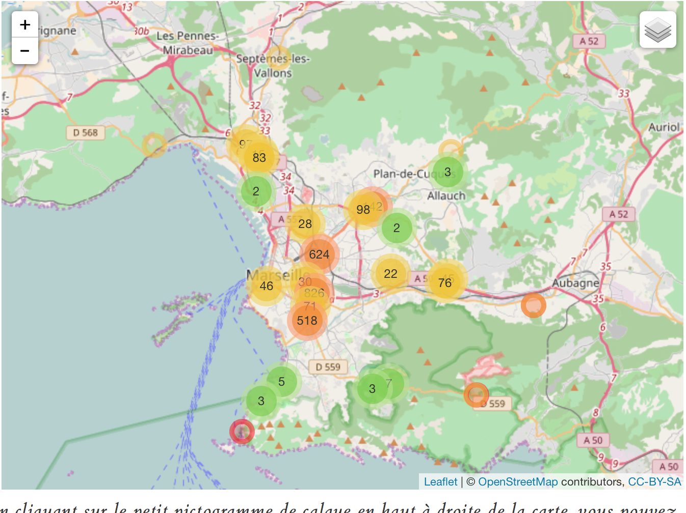

layout: true
  

`r paste0("<div class='my-footer'><span>", params$event, "</span> <center><div class=logo></center></span></div>")` 


---

class: center, middle

Ces slides en ligne : `r paste0("http://datactivist.coop/", params$slug, "/", params$mission, "/", params$session)`

Sources : `r paste0("https://github.com/datactivist/", params$slug)`


Les productions de Datactivist sont librement réutilisables selon les termes de la licence [Creative Commons 4.0 BY-SA](https://creativecommons.org/licenses/by-sa/4.0/legalcode.fr).

<BR>
<BR>

.reduite[]


---


### We .red[open data], we make them .red[useful]

.reduite.center[]

---
## Qui sommes nous ?

- Datactivist est un .red[**pure player de l’open data**] créé en 2016, par Samuel Goëta et Joël Gombin.

- Se positionnant sur .red[**toutes les étapes du travail d’ouverture des données**], Datactivist travaille tant avec les producteurs de données qu’avec les réutilisateurs et participe à l’appropriation des données par chacun.

- Nous appliquons nos propres .red[**valeurs**] : nous sommes une coopérative ; nos supports de formation et nos contenus sont librement réutilisables, publiés en licence Creative Commons.

- Une approche issue de la recherche : voir notamment **https://datactivist.coop/these**. 

- Nous animons la communauté [#TeamOpenData](https://teamopendata.org).

---
## Nos activités

- Conseil sur les .red[**stratégies d’ouverture de données**] : nous aidons les organisations dans la conception et la mise en œuvre de leur stratégie d’ouverture de données.


- .red[**Accompagnement dans la réutilisation de données ouvertes**] : nous aidons les organisations à utiliser les données au quotidien. 

- .red[**Sensibilisation et formation à la donnée**] : nous formons à la culture générale des données, nous enseignons les grands principes et bonnes pratiques de l'open data et nous introduisons à la data science. 

- .red[**Médiation de données**] : nous organisons des hackathons, des open data camps, des expéditions de données...

???

La médiation de données est aussi fondamentalement une animation de communauté(s). 

---
## Notre vision

### D'un open data de l'offre à un .red[open data de la demande]

Aujourd’hui, les administrations choisissent les données à ouvrir, elles décident du quand et du comment .red[**sans consulter les usagers**].

Les rares données ouvertes sont souvent décevantes : pas à jour, trop agrégées, mal documentées, mal formatées, parfois inutilisables. 

Il faut aujourd’hui passer à l’étape supérieure : .red[**un open data piloté par la demande**].

Mais c'est difficile : demande peu visible, pas de possibilité de soumettre la communication des données à l'expression d'une demande. Leviers : demandes d'ouverture, plateformes, animations (ex : hackathon), gouvernance partagée... 

---

### Rappel des objectifs de la journée

> * Comprendre les grands principes de l'ouverture des données;

> * Appréhender le cadre juridique spécifique aux données publiques;

> * Maitriser les enjeux liés à la vie privée et au cadre réglementaire du RGPD;

> * Développer un discours sur les bénéfices de l'ouverture des données à destination des élu·es, producteur·rices, services techniques et du grand public.


---

### Rappel du programme de la formation 

.pull-left[
Mardi 24 novembre 2020 :
.red[**élaborer un discours sur l'open data**]

* 10h30 - 11h30 : histoire et principes de l'open data ;
* 11h30 - 12h30 : législation et cadre réglementaire de l'open data;
* 14h00 - 15h00 : l'open data face au RGPD et au respect de la vie privée ;
* 15h00 - 16h00 : les bénéfices de l'ouverture de données ;
* 16h00 - 17h00 : atelier de formalisation d'un argumentaire.
]

.pull-right[
Sessions suivantes :

* Lundi 30 novembre : .red[**la gestion de projet open data 1**] (livrable : **une cartographie des acteurs**)

* Mardi 8 décembre : .red[**la gestion de projet open data 2**] (livrable : **une cartographie des données**)

* Lundi 14 décembre : .red[**cas pratique : une publication de données de A à Z**] (livrable : **un jeu de données prêt à publier**)
]

---

background-image: url("https://media.giphy.com/media/xT9IgsTMqIWwi21XWM/giphy.gif")
class: center, top, inverse

# 1. L'open data : histoire et culture

---

### [.red[Les multiples facettes]](https://books.openedition.org/cdf/5005?lang=fr)  de l'open data

.reduite.center[]

--
Selon vous, quelle facette est-elle la plus porteuse actuellement ?

---
### Open data : un terme récent

Le terme est apparu pour la première fois dans les années 1970 dans les accords qu’a signés la NASA avec des pays partenaires en vue du partage de données satellitaires. 

C’est en 1995 qu’on en voit le premier usage public aux Etats-Unis dans un rapport de la National Academy of Science intitutlé "_On the Full and Open Exchange of Scientific Data_".

Dans le langage courant, cela fait près de 10 ans que l'ouverture des données est devenue un élément majeur des politiques publiques numériques. 

** Explorons maintenant quelques grandes dates de l'apparition de l'open data.**

---
### 2005 : [Open Definition](https://opendefinition.org/)

#### Une définition juridique des droits de l'usager d'un savoir ouvert\*


.center[]

.footnote[\*Impulsée par Open Knowledge Foundation, une organisation de la société civile !]

---
### 2007 : [la rencontre de Sebastopol ](https://opengovdata.org/)

.pull-left[
**Quoi ?** Une rencontre de l'Open Governement Group à Sebastopol (Californie), siège des éditions O'Reilly

**Pourquoi ?** : Influencer le futur président des Etats Unis pour faire avancer l'open data

**Comment ?** En adoptant une déclaration définissant les grands principes de l'Open Government Data 

]

.pull-right[

]
---
class:middle, center

# Revue des principes

---
class: middle, center

# 1. Des données complètes
### Toutes les données publiques doivent être rendues disponibles dans les limites légales liées à la vie privée ou la sécurité
---
class: center, middle

# BY DEFAULT
---
class: middle, center

# 2. Des données primaires
###  Les données ouvertes sont telles que collectées à la source, non-agrégées avec le plus haut niveau de granularité

---
class: middle, center

# 3. Des données fraiches (*timely*)
### Les données doivent être disponibles dès qu'elles sont produites

---
class: middle, center

# 4. Des données accessibles 
### Les données doivent être utilisables par le plus grand nombre d’usagers potentiels

---
class: middle, center

# 5. Des données exploitables par les machines 
###  Les données peuvent être traitées automatiquement par les machines

---
class: middle, center

# 6. Des données non discriminatoires 
### Elles peuvent être utilisées par tous sans réclamer un enregistrement préalable
---
class: middle, center

# 7. Des données dans un format ouvert
### Ce format ne doit pas être la propriété d'une organisation en particulier (.xls) et doit être gouverné par ses usagers

---
class: middle, center

# 8. Des données dans une licence ouverte
### Idéalement dans le domaine public sinon dans une licence conforme à l'[Open Definition](www.opendefinition.org) : Licence Ouverte (CC-BY) ou ODBL (CC-BY-SA)

---
### 2008 : Tim Berners-Lee ["Raw data now"](https://www.ted.com/talks/tim_berners_lee_on_the_next_web?language=fr)
#### La demande de données brutes sous les projecteurs

.reduite[.center[

]]
---
### 2010 : [le modèle en 5 étoiles de Tim Berners-Lee](https://5stardata.info/fr/)

.reduite[.center[]]

---
## Des principes techniques sans portée politique
>"Il peut être vrai en un sens qu'un régime devient plus ouvert chaque fois qu'il fournit des données ouvertes supplémentaires, même pour les sujets banals et apolitiques, mais il est facile d'imaginer qu'un régime fermé pourrait divulguer de grandes quantités de données conformes à ces huit exigences [de Sébastopol] **sans pour autant accroître sa responsabilité réelle en tant que gouvernement **. 

> Une diffusion électronique des déclarations de propagande faites par les dirigeants politiques de la Corée du Nord, par exemple, pourrait satisfaire à ces huit exigences et ne pas promouvoir une transparence ou une responsabilité supplémentaires de la part d'un régime notoirement fermé et opaque."

>Yu & Robinson (2012) « [The New Ambiguity of Open Government](https://papers.ssrn.com/sol3/papers.cfm?abstract_id=2012489) » 

---

background-image: url("https://media.giphy.com/media/h8WAdB9nUdraM/giphy.gif")
class: center, top

### 2011 : [à l'ONU, Barack Obama initie le Partenariat pour un gouvernement ouvert](https://obamawhitehouse.archives.gov/open/partnership)

---
### [Le fonctionnement du PGO](http://www.opengovpartnership.org/sites/default/files/OGP_Booklet_20160911_FR.pdf)

.center[.reduite[]]

---
### Depuis 2010 : l'ère des classements
[](https://opendatabarometer.org/)

---

### Depuis 2010 : l'ère des classements
[](https://index.okfn.org/place/)

---

### 2013 : la [charte du G8 sur l'open data](https://www.modernisation.gouv.fr/sites/default/files/fichiers-attaches/charte-g8-ouverture-donnees-publiques-fr.pdf)


---

### 2015 : la [charte internationale de l'open data]()
.reduite[.center[

]]

---

### Récapitulons

* à quelles questions avons-nous répondu ?
* de quelles sources disposons-nous pour nous informer ?
* à quelles questions n'avons-nous pas répondu ?
* quelles sources manquent ?
* quels sujets mériteraient d'être creusés dans ce chapître ?

---

background-image: url("https://media.giphy.com/media/1mhNoEF2qRTllNqx1r/giphy.gif")
class: center, top, inverse

# 2. Législation et règlementation de l'open data


---

background-image: url("https://media.giphy.com/media/l0MYLc6a1BDBwYqEE/giphy.gif")
class: center, top, inverse

## 2.1 Le cadre juridique général en France


---

### Le guide CADA-CNIL : le document de référence

Le guide pratique de la publication en ligne et de la réutilisation des données publiques publié conjointement par la Cada et la Cnil constitue une source de référence. Joël Gombin, co-fondateur de Datactivist, a publié sa [fiche de lecture](https://teamopendata.org/t/guide-commun-cnil-et-cada-open-data-rgpd/1320) sur TeamOpenData.

Parcourons-le ensemble.

.reduite[.center[
[](https://www.cnil.fr/sites/default/files/atoms/files/guide_open_data.pdf)
]]

---

### 1978 : La loi CADA, vers le "droit de savoir"
* Le fondement : la .red[Déclaration des Droits de l'Homme et du Citoyen de 1789] dans son article 15, "la Société a le droit de demander compte à tout Agent public de son administration." 

* Le droit d'accès des citoyens à l'information publique émerge en **1978 avec la loi dite CADA** du nom de la Commission d'Accès aux Documents Administratifs. 

* La France était le .red[3e pays au monde] après la Suède en 1766 et les Etats-Unis avec le Freedom of Information Act (FOIA) en 1966  à accorder un "droit de savoir" avec pour but d'améliorer les relations entre le public et l'administration.

.footnote[Il faudrait maintenant désigner la loi comme le Code des relations entre le public et l'administration (CRPA) qui, dans son [livre 3](https://www.legifrance.gouv.fr/affichCode.do;jsessionid=BDF8EC0BD562E214CCD9A5ADD435D690.tplgfr42s_1?idSectionTA=LEGISCTA000031367685&cidTexte=LEGITEXT000031366350&dateTexte=20190429), codifie le droit d'accès et de réutilisation mais il est encore moins connu que la loi CADA…]

---

### La loi CADA : un point noir dans la transparence de la vie publique

Même si la France est le 3e pays à avoir adopté un droit d'accès, la loi CADA n'est pas un outil fort de la transparence de la vie publique. Ses principaux défauts : l'absence de sanctions et une procédure longue qui décourage les demandeurs et favorise le contournement par les administrations. 
[](http://europam.eu/?module=country-profile&country=France)

---

### Un droit d'accès très faible au regard des standards internationaux

.pull-left[Paradoxe : la France a une législation parmi les plus ambitieuses au monde en matière d'open data mais le droit d'accès y est un des plus mauvais au monde… 

La France est classée .red[105e sur 123] du classement mondial des lois d'accès à l'information publique RTI Rating.

L'open data est comme la Tour de Pise : un très bel édifice posé sur des fondations instables.
]

.pull-right[
[](https://www.rti-rating.org/country-data/)
]

---

### Les conditions d'exercice du droit d'accès

.red[ Une définition très large des documents administratifs]
> Les documents administratifs peuvent revêtir de nombreuses formes (dossiers, rapports, études, comptes rendus, procès-verbaux, statistiques, directives, instructions, circulaires, codes sources, etc.) et adopter tout support (écrit, enregistrement sonore ou visuel, forme numérique ou informatique). 

Le droit d'accès s'appplique aux documents administratifs produits dans le cadre d'une .red[mission de service public] ie :
> Une mission d'intérêt général sous le contrôle de l'administration et qui est dotée à cette fin de prérogatives de puissance publique est chargée de l'exécution d'un service public. 

Il ne s’exerce que si l’administration a effectivement en sa possession le document demandé, que si le document est formellement **achevé**, qu'il existe et qu'il n'est pas **préparatoire à une décision administrative** en cours. 

---

### Les exclusions au droit d'accès

Le droit d'accès .red[**ne doit pas porter atteinte aux secrets protégés**] : 
- le fonctionnement de l'État : délibérations du Gouvernement, secret de la défense nationale, la conduite de la politique extérieure de la France, la sûreté de l'État…
- la protection de la vie privée (nous y reviendrons précisément en partie 3)
- le secret médical
- le secret des affaires (secret des procédés, des informations économiques et financières et
des stratégies commerciales ou industrielle)
- les mentions portant une appréciation ou un jugement de valeur sur une personne physique ou
faisant apparaître un comportement d'une personne pouvant lui porter préjudice…

Le document ne peut être publié qu'après avoir fait l'objet d'un traitement permettant
d'.red[**occulter les mentions protégées**]. L’administration n’est pas tenue de publier un document lorsque “les travaux d’occultation dénatureraient ou videraient de sens le document” ou si “le document est indivisible ou l’occultation est trop complexe”.

---
### Du droit d'accès au droit de réutilisation

Alors qu'aux Etats-Unis les données publiques sont placées dans le domaine public depuis les années 70, la question de la réutilisation des données publiques a émergé en France et en Europe dans les années 1990 avec le développement d'Internet facilitant la diffusion des données publiques et le développement de nouveaux services au public. Quelques jalons :

```{r echo=FALSE}
library(timevis)
data <- data.frame(
  id      = 1:7,
  content = c("Loi CADA","Directive PSI", "Directive INSPIRE", "Révision de la directive PSI", "Loi Notre", "Loi Valter", "Loi pour une République Numérique"),
  start   = c("1978-07-17","2003-11-17", "2007-03-14","2013-06-13","2015-08-07","2015-12-28","2016-10-07")
)
timevis(data, loadDependencies = FALSE, width = "715px", height = "350px")
```

---

### Le droit de réutilisation en archives

La .red[**réutilisation des informations publiques**] désigne l'utilisation de documents ou de données par un tiers, pour d’autres fins que celles pour lesquelles ils ont été produits ou reçus initialement.

Les .red[**informations publiques**] sont tous les documents sauf ceux couverts par un délai de communicabilité et ceux sur lesquels des tiers détiennent des droits de propriété intellectuelle.

Un principe : la .red[**gratuité de la réutilisation**] mais avec des exceptions, notamment lorsque la réutilisation porte sur :
> *Des informations issues des opérations de numérisation des fonds et des collections [...] des archives et, le cas échéant, sur des informations qui y sont associées lorsque ces dernières sont commercialisées conjointement.* 

Les licences :
* Si gratuité : licence facultative (à choisir dans une liste fixée par l'Etat) :
* Si redevance : licence obligatoire.

---

### Loi pour une République Numérique : l'ouverture des données par défaut


Promulguée le 7 octobre 2016, après 4 ans d'annonces et de consultation, le titre 1 de la [loi pour une République  Numérique](https://www.legifrance.gouv.fr/affichTexte.do;jsessionid=B5632993E54F7CCC2606664B64CDF612.tpdila11v_1?cidTexte=JORFTEXT000033202746&categorieLien=id) porte sur l'ouverture des données publiques. 

La loi impose un principe d'.red[**ouverture des données par principe**] qui ne fait pas l'objet de sanctions à toutes les administrations, les entreprises délégataires d'une mission de service public et les .red[**collectivités locales de plus de 3500 habitants et 50 agents**]. 

L'ouverture concerne un .red[**périmètre très large**] : 
* les documents communiqués suite à des demandes CADA
* les "bases de données"
* les données "dont la publication présente un intérêt économique, social, sanitaire ou environnemental".
Rares sont donc les données publiques qui ne sont pas concernées par cette obligation d'ouverture. 

---

### La définition des données

Le guide CADA-CNIL rappelle la **définition des "bases de données"**

> On entend par base de données un recueil d'œuvres, de données ou d'autres éléments indépendants, disposés de manière systématique ou méthodique, et individuellement accessibles par des moyens électroniques ou par tout autre moyen (art L112-3 du code de la propriété intellectuelle)

> En d’autres termes il s’agit d’un ensemble de données organisé en vue de son utilisation par des programmes correspondant à des applications distinctes et de manière à faciliter l'évolution indépendante des données et des programmes (en anglais : data base)

Le document donne également une **définition de ce qu'est une "donnée"** :

> Une donnée correspond à la représentation d'une information sous une forme conventionnelle destinée à faciliter son traitement (en anglais : data).

---

### Loi pour une République numérique : l'utilisation de standards ouverts


Afin de faciliter la réutilisation des données par les machines, la loi pour une République Numérique consacre **l'utilisation de standards ouverts** pour la communication des documents administratifs. 

L’administration est dorénavant tenue, lorsqu’elle communique un document administratif au format électronique, de le mettre à disposition du citoyen **"dans un standard ouvert, aisément réutilisable et exploitable par un système de traitement automatisé"**. 

Concrètement, cela devrait empêcher la publication de fichiers PDF là où un fichier CSV **pourrait être** diffusé.

---

### Loi pour une République numérique : une limitation des licences

La loi **limite par décret les licences** qui peuvent être utilisées par les administrations. Le [décret du 27 avril 2017](https://www.legifrance.gouv.fr/eli/decret/2017/4/27/2017-638/jo/texte) autorise deux licences : 

* la Licence Ouverte d'Etalab 

* la licence ODbL (Open Database License).

Ces deux licences offrent **un choix aux administrations** : la licence ouverte étant plus permissive que la licence ODBL qui a été conçue dans une logique de "pot commun" permettant de garantir que les données resteront ouvertes après leur réutilisation.

Utiliser une autre licence impose une **homologation** auprès de la DINSIC avec un exposé des motifs ayant conduit à sortir de la liste fixée dans le décret et une consultation des usagers affectés par la licence proposée. L'homologation doit être faite pour chaque jeu de données même si la licence reste la même.

---

### Loi pour une République numérique : une limitation des licences

.reduite.center[
[](http://www.opendatalab.fr/index.php/laboratoire/le-kit-collectivites)
]
.footnote[source : [SGAR Occitanie](http://www.opendatalab.fr/index.php/laboratoire/le-kit-collectivites)]

---

background-image: url("https://media.giphy.com/media/13bUdxDy4jJUR2/giphy.gif")
class: center, top, inverse

## 2.2 Les obligations des collectivités territoriales

---

### Les collectivités concernées

L'association Open Data France a évalué à 4604 les collectivités concernées par l'obligation d'ouverture. [Dans son dernier Observatoire de l'open data des territoires](https://www.opendatafrance.net/2020/10/15/observatoire-open-data-des-territoires-edition-oct-2020/) (octobre 2020), elle comptait 503 collectivités ayant au moins publié un jeu de données, soit moins de 11% du total. Remarquant une relation forte entre la taille des administrations et leur niveau d'ouverture :

.center[
]

---

### Les obligations de publication

Depuis le 7 octobre 2018, les collectivités territoriales se voient dans l'obligation de respecter le principe de **.red[l'open data par défaut]**.

Nous pouvons dégager cinq catégories (cf. [la synthèse qu'en fait la Cnil](https://www.cnil.fr/fr/les-collectivites-territoriales-et-lopen-data-concilier-ouverture-des-donnees-et-protection-des)) :

> * les documents qu'elles communiquent en application des procédures prévues par le CRPA, ainsi que leurs versions mises à jour ;
* les documents qui figurent dans le répertoire des informations publiques (RIP) ;
* les bases de données, mises à jour de façon régulière, qu'elles produisent ou qu'elles reçoivent et qui ne font pas l'objet d'une diffusion publique par ailleurs ;
* les données, mises à jour de façon régulière, dont la publication présente un intérêt économique, social, sanitaire ou environnemental.
* les règles définissant les principaux traitements algorithmiques utilisés dans l'accomplissement de leurs missions, lorsque ces traitements fondent des décisions individuelles.

---

### Cas particulier : la commande publique

Deux arrêtés fixent les modalités de publication des données essentielles de la commande publique (DECP) :
* l'[arrêté du 14 avril 2017](https://www.legifrance.gouv.fr/jorf/id/JORFTEXT000034492587?r=Uf7YJqzL34) relatif aux données essentielles dans la commande publique
* l'[arrêté du 27 juillet 2018](https://www.legifrance.gouv.fr/jorf/id/JORFTEXT000037282994/) modifiant l'arrêté du 14 avril 2017 relatif aux données essentielles dans la commande publique.

Entrés en vigueur le 1er octobre 2018, ils instaurent l'obligation de publication des DECP sur leurs profils acheteurs pour tous les marchés supérieurs à 40000 euros aux 70000 acheteurs publics français : ministères, hôpitaux, etc. et, bien sûr, collectivités territoriales.

Autre particularité : cette obligation s'accompagne d'un format réglementaire. Celui-ci est décrit sur le site [schema.data.gouv.fr](https://schema.data.gouv.fr/139bercy/format-commande-publique/latest.html).


---

### Cas particulier : les hauts salaires

.pull-left[Au 1er mai 2020, les collectivités territoriales de plus de 80000 habitant·es et EPCI à fiscalité propre couvrant un même périmètre devaient publier sur Internet la somme des dix rémunérations les plus hautes des agents qu'elles employaient ainsi que la répartition entre hommes et femmes.

Cette disposition visant à s'aligner sur les standards de transparence du privé et à permettre la production d'un rapport sur les hautes rémunérations a, [d'après le site La gazette des communes](https://www.lagazettedescommunes.com/690398/exclusif-ce-quon-peut-retenir-des-declarations-des-10-plus-hautes-remunerations), été peu suivie :
]

.pull-right[


> *"A ce jour, ont pu être extraites, parfois non sans peine, les données de 21 communes (sur 58 communes concernées), 33 départements et 9 régions."*]

---

### Les schémas réglementaires

La mission Etalab a initié une démarche de centralisation des schémas de données réglementaires sur le site [schema.data.gouv.fr](https://schema.data.gouv.fr/documentation/schemas-reglementaires).

Y sont référencés les schémas justifiés par voie réglementaire (et les textes de référence associés) ou par voie d'usage.

A l'heure où nous présentons cette formation, on peut y trouver :
* [le schéma des DECP](https://schema.data.gouv.fr/etalab/format-commande-publique/latest.html) *(actuellement en broken link)* ;
* [le schéma de déclaration de profil acheteur](https://schema.data.gouv.fr/etalab/schema-decp-dpa/latest.html) ;
* [le schéma des données de subvention publique](https://schema.data.gouv.fr/scdl/subventions/latest.html) *(également en broken link)* ;
* [le schéma infrastructure de rechargement de voiture électrique (IRVE)](https://schema.data.gouv.fr/etalab/schema-irve/latest.html).

---

### Les bonnes pratiques : le SCDL

L'association Open Data France a mis sur pied une initiative du même ordre mais élargissant le concept au delà du cadre réglementaire : le socle commun des données locales (ou [SCDL](https://scdl.opendatafrance.net/docs/)).

.center[

]

Cette compilation couvre un spectre bien plus large, allant des données de subventions aux défibrilateurs, et s'organise comme un espace de partage de bonnes pratiques.

---

### Les bonnes pratiques : Validata

.pull-left[Dans la continuité de ce projet, le site [Validata](https://validata.fr/doku.php) propose une outil de validation des données ouvertes.

S'appuyant prioritairement sur les schémas du SCDL, l'outil propose également d'autres sources pour valider les jeux de données :
* des schémas proche du SCDL ;
* des schémas au format [TableSchema](https://specs.frictionlessdata.io/table-schema/) développé dans le cadre de [FictionlessData](https://frictionlessdata.io/) ;
* d'autres validateurs ([Inspire](https://inspire.ec.europa.eu/validator/about/), [BAL](https://adresse.data.gouv.fr/bases-locales/validateur) et [CVDTC]())
]

.pull-right[]

---

### Récapitulons

* à quelles questions avons-nous répondu ?
* de quelles sources disposons-nous pour nous informer ?
* à quelles questions n'avons-nous pas répondu ?
* quelles sources manquent ?
* quels sujets mériteraient d'être creusés dans ce chapître ?


---

background-image: url("https://media.giphy.com/media/3o7ypQrBRJ202iBEYw/giphy.gif")
class: center, top, inverse

# 3. L'open data face au RGPD et au respect de la vie privée

---

### Du droit d'accès au droit de réutiliser les données

* Le droit d'accès des citoyens à l'information publique émerge en **1978 avec la loi dite CADA** du nom de la Commission d'Accès aux Documents Administratifs. 

* Mais il faut attendre les années 90 pour que le législateur s'intéresse à la réutilisation des informations publiques

> 2015 : Loi Valter et gratuité de la réutilisation des infos publiques (et redevances deviennent l'exception)

> 2016 : Loi Lemaire et le principe d'ouverture par défaut

**MAIS...**

---
### Le cas des données personnelles

La mise en ligne de données à caractère personnel sans anonymisation n'est permise que dans .red[**trois cas**] :
1. une disposition législative contraire le prévoit (exemple : [Transparence Santé](https://www.data.gouv.fr/fr/datasets/transparence-sante-1/))
2. si les personnes intéressées ont donné leur accord (consentement au sens de l’article 4 du RGPD)
3. les documents relevant de [l’article D312-3-1 du CRPA](https://www.legifrance.gouv.fr/affichTexte.do;jsessionid=51E99AF738C12521572D6A7F6C8C03E8.tplgfr23s_1?cidTexte=JORFTEXT000037797147&dateTexte=&oldAction=rechJO&categorieLien=id&idJO=JORFCONT000037796937)


Hors de ces cas, il faut .red[**anonymiser les données**].

.center[]

---
### Anonymisation vs pseudonymisation

**Anonymiser** = rendre totalement impossible la ré-identification des données. Des données anonymes ne sont plus soumises au RGPD.

**Pseudonymiser** = limiter fortement les possibilités de ré-identification en remplaçant des DCP par un élément non signifiant (numéro incrémental dans une liste par ex.)

.center[]

---
### Cas pratique n° 1

> Les élu·e·s

* Publication du [RNE](https://www.data.gouv.fr/fr/datasets/repertoire-national-des-elus-1/) pour les [titulaires de mandat](https://data.bretagne.bzh/explore/dataset/les-elues-du-conseil-regional-de-bretagne/table/?sort=nom_de_l_elu) et parfois dans une [perspective historique](https://opendata.paris.fr/explore/dataset/les-conseillers-de-paris-de-1977-a-2014/table/)

* [Elu·e·s d'organismes tiers](https://data.bretagne.bzh/explore/dataset/membres-ceser-bretagne/table/) 

.center[]

---
### Cas pratique n° 2

> L'Etat Civil

* [Anonyme or not anonyme?](https://opendata.paris.fr/explore/dataset/liste_des_prenoms/table/?disjunctive.annee&disjunctive.prenoms&sort=-nombre) 

* Le fichier de l'[INSEE](https://www.data.gouv.fr/fr/datasets/ficher-des-prenoms-de-1900-a-2019/)

* [Et ces données là?](https://deces.matchid.io/search) 

.center[]


---
### Cas pratique n° 3

> Les subventions

* Cadre règlementaire : obligation pour les subventions de plus de 23 000 euros

* Un exemple de [jeu de données](https://data.bretagne.bzh/explore/dataset/subventions_attribuees_scdl0/table/?refine.tiers_categorie=Entreprise)

.center[]

---
### Les bonnes pratiques pour concilier OD et RGPD

* Se rapprocher des DPO, PRADA, juristes de la collectivité
* Se demander si les données comportent des DCP
* Si oui, chercher sur quoi se fonde la publication (obligation?) et si les personnes ont donné leur accord
* Envisager de supprimer totalement les DCP (nom) ou de les [agréger (adresse)](https://opendata.grdf.fr/explore/dataset/consommation-annuelle-gaz-agregee-maille-iris/map/?disjunctive.code_region&disjunctive.nom_region&location=7,47.1561,1.77429)

.center[]

---
### Ressources

* [Guide CNIL/CADA](https://www.cnil.fr/sites/default/files/atoms/files/guide_open_data.pdf) et sa [fiche de lecture](https://teamopendata.org/t/guide-commun-cnil-et-cada-open-data-rgpd/1320) sur TeamOpenData.
* [Le site de la CNIL](https://www.cnil.fr/professionnel)
* [Le site de la CADA](https://www.cada.fr/) 
* A emprunter au centre de doc [Juris'Data](https://data.bnf.fr/fr/temp-work/45ccc43af251e300ca5b6fdbbeee1b8d/)
* [Open data lab de la Région Occitanie](http://www.opendatalab.fr/)
* [Guide Etalab](https://guides.etalab.gouv.fr/pseudonymisation/pourquoi-comment/)

.center[]

---


background-image: url("https://media.giphy.com/media/cNfdCiR00n8kCKeuhJ/giphy.gif")
class: center, top, inverse

# 4. Bénéfices de l'open data


---

background-image: url("https://media.giphy.com/media/UsAAvUr9HIoqMhZHaU/giphy.gif")
class: center, top, inverse

## 4.1 L'open data, ça sert à qui?

---

### Les agents de l'administration


---

### Les autres administrations

* .red[**communiquer**] : comme la région Grand Est avec [son rapport New Deal Mobile](https://www.prefectures-regions.gouv.fr/grand-est/Region-et-institutions/Portrait-de-la-region/Note-rapide/New-Deal-Mobile-deux-annees-de-progression-de-la-couverture-en-reseau-mobile-4G-dans-le-Grand-Est) sur le déploiement de la 4G s'appuyant sur les données de l'Arcep ;

---

### Les citoyen·nes et la société civile

La **.red[responsabilité]** des agents publics vis-à-vis des administré·es inscrite dans la Déclaration des Droits de l'Homme et du Citoyen de 1789 forme la base de la politique d'open data comme levier d'information des citoyen·nes.

La LRN 

* à [l'association de défense de la qualité de l'air Respire](https://www.respire-asso.org/la-carte-des-ecoles-polluees-en-ile-de-france/) de cartographier les écoles les plus exposées aux polluants aériens en Île-de-France ; 
* à [un syndicat d'agriculteur·rices bio](https://www.data.gouv.fr/en/datasets/observatoire-eau-et-bio-pays-de-la-loire/) de mettre à disposition des données sur la diffusion des polluants en Pays-de-la-Loire ;
* à [l'association Euros for docs](https://www.eurosfordocs.fr/) de faciliter la recherche d'éventuels conflits d'intérêts chez les professionnels de santé en France en explorant leurs liens avec les industries de santé ;
* et beaucoup d'autres projets encore !


---

### Les entreprises

La publication en données ouvertes d'information d'intérêt général permet la création ou l'amélioration de nombreux services proposés par des entreprises.

Parmi les exemples les plus courants, on peut noter les applications de transport comme [Geovelo](https://www.geovelo.fr/), [Karos](https://www.data.gouv.fr/fr/reuses/karos-1/) ou [Moovit](https://moovitapp.com/), qui s'alimentent en temps réel aux fichiers des pistes cyclables ou aux données GFTS des transports en commun.

Mais beaucoup d'autres services s'y adossent, notamment avec l'utilisation des APIs :
* en consultant les données des valeurs foncières pour estimer les prix des biens ;
* en appelant la base Sirene pour les informations sur les entreprises ;
* en consultant les agendas pour proposer des sorties ;
* etc.

---

#### Exemple : QuiDitMiam

Lancée en s'appuyant sur les menus des cantines ouverts à Toulouse, l'application QuiDitMiam propose un accès aux menus des restaurations collectives en y ajoutant une couche d'information sur les allergènes, label, etc.

Voir leur fiche réutilisation sur [data.gouv.fr](https://www.data.gouv.fr/en/reuses/quiditmiam/).


---

background-image: url("https://media.giphy.com/media/l0G18BkChcRRctMZ2/giphy.gif")
class: center, top, inverse

## 4.2 L'open data, ça sert à quoi?

---

### Exemple de données ouvertes : la [base SIRENE](https://www.data.gouv.fr/fr/datasets/base-sirene-des-entreprises-et-de-leurs-etablissements-siren-siret/)

.reduite.center[]

---

### La base SIRENE : exemple de cas d'utilisation

.reduite[.center[]]

---

### Exemple de données ouvertes : la [base adresse nationale](https://www.data.gouv.fr/fr/datasets/base-adresse-nationale/)
.reduite[.center[]]

---

### Exemple de données ouvertes : les [accidents de la route](https://www.data.gouv.fr/fr/datasets/base-de-donnees-accidents-corporels-de-la-circulation/)
.reduite.center[]
---

### Exemple de données ouvertes : Les accidents de la route
.reduite.center[]
.footnote[Plus d'accidents sur l'A8 mais surtout plus de véhicules…]

---

### Exemple de données ouvertes : les accidents de la route
.reduite.center[]
.footnote[[Carte par Joël Gombin dans Marsactu](https://joelgombin.github.io/marsactu_accidents/chronique.html)]

---

### Exemple de données ouvertes : les [inspections des restaurants](https://www.data.gouv.fr/fr/datasets/resultats-des-controles-officiels-sanitaires-dispositif-dinformation-alimconfiance/)
.reduite.center[]
.footnote[[Résultats des contrôles officiels sanitaires : dispositif d'information « Alim’confiance »](https://www.data.gouv.fr/fr/datasets/resultats-des-controles-officiels-sanitaires-dispositif-dinformation-alimconfiance/)]

---

### Exemple de données ouvertes : les inspections des restaurants
.reduite[.center[]]
.footnote[[155 établissements dont l'hygiène doit être corrigée de manière urgente ](https://dgal.opendatasoft.com/explore/dataset/export_alimconfiance/table/?disjunctive.filtre&disjunctive.app_libelle_activite_etablissement&disjunctive.ods_type_activite&refine.synthese_eval_sanit=A+corriger+de+mani%C3%A8re+urgente)]

---

### Exemple de données ouvertes : le [répertoire national des élus](https://www.data.gouv.fr/fr/datasets/donnees-du-repertoire-national-des-elus/)

.reduite.center[

]

---

### Exemple de données ouvertes : les [valeurs foncières](https://www.data.gouv.fr/fr/datasets/demandes-de-valeurs-foncieres/#_)


---

### Exemple de données ouvertes : les valeurs foncières

.reduite.center[
[](https://www.meilleursagents.com/prix-immobilier/dvf/aix-en-provence-13100/avenue-saint-jerome-1108044769/)
]

---

### Exemple de données ouvertes : [Santé Publique France sur la Covid-19](https://www.data.gouv.fr/fr/datasets/donnees-hospitalieres-relatives-a-lepidemie-de-covid-19/)


---

### Exemple de données ouvertes : [Campagnes photographiques des Monuments Historiques](https://data.culture.gouv.fr/explore/dataset/photographies-serie-monuments-historiques-de-1851-a-1914/images/?refine.nom_reg=BRETAGNE&refine.nom_dept=FINISTERE&dataChart=eyJxdWVyaWVzIjpbeyJjaGFydHMiOlt7InR5cGUiOiJjb2x1bW4iLCJmdW5jIjoiQ09VTlQiLCJzY2llbnRpZmljRGlzcGxheSI6dHJ1ZSwiY29sb3IiOiIjNjZjMmE1In1dLCJ4QXhpcyI6Im5vbV9yZWciLCJtYXhwb2ludHMiOjUwLCJzb3J0IjoiIiwiY29uZmlnIjp7ImRhdGFzZXQiOiJwaG90b2dyYXBoaWVzLXNlcmllLW1vbnVtZW50cy1oaXN0b3JpcXVlcy1kZS0xODUxLWEtMTkxNCIsIm9wdGlvbnMiOnt9fX1dLCJ0aW1lc2NhbGUiOiIiLCJkaXNwbGF5TGVnZW5kIjp0cnVlLCJhbGlnbk1vbnRoIjp0cnVlfQ%3D%3D&location=5,46.50652,2.39891)


---

### Exemple de données ouvertes : [Les AD des Hauts-de-Seine](https://opendata.hauts-de-seine.fr/explore/dataset/cartes-postales/information/)

Un projet mélant open data et indexation collaborative


---

### Quelques compilations de réutilisations : data.gouv.fr

La plateforme data.gouv.fr propose un recensement de réutilisation des jeux de données publiées [dans une rubrique dédiée](https://www.data.gouv.fr/fr/reuses/). Elle met également à l'honneur les cas les plus emblématiques en page d'accueil dans son carrousselle, aux côtés des derniers jeux de données publiés et des jeux de données mis en avant.


---

### Quelques compilations de réutilisations : ODF

L'association Open Data France a publié en juin 2019 un rapport.


---

background-image: url("https://media.giphy.com/media/hP9niPzFXqjfi/giphy.gif")
class: center, top, inverse

# 5. Elaborons un argumentaire !


---

class: center, top, inverse

## La construction de l'argumentaire

### Objectif

Cet argumentaire vise à disposer d'arguments, références et exemples pour répondre aux principales questions que seront amenés à poser les interlocuteur·rices dans le cadre d'une démarche open data.

---

### 1. Les grands thèmes

La première étape de la construction de l'argumentaire sera d'en dégager **les grands thèmes**.

Pour ce faire, nous proposons de lister ceux abordés dans cette journée de formation :
* **les grands principes** ;
* **la législation** ;
* **le respect de la vie privée** ; 
* **l'intérêt pour les acteurs**.

--

En voyez-vous d'autres que vous pensez pertinents ?

Tout thème est bon à prendre du moment que vous pensez qu'il constitue une catégorie à laquelle vous pourrez vous référer spontanément et que des questions pourraient venir sur ce thème précis.

---

### 2. Les questions

Nous allons maintenant lister les questions et les répartir dans les grands thèmes.

Pour cela, nous vous proposons deux approches :

.pull-left[#### lister l'intégralité des questions et les répartir

Vous pouvez tout réunir, en mode brainstorming, et y ajouter les questions que vous aviez vous-même réuni pour cette session.

Une fois la liste complète, reprenez vos grands thèmes et répartissez vos questions. Quitte à ajouter des catégories qui manqueraient à l'appel.
]


.pull-right[#### lister les questions thème par thème

Vous pouvez prendre les thèmes les uns après les autres et voir quelles questions ils vous inspirent. Cela vous donnera un premier panorama que vous pourrez compléter ou réduire pour éviter les redites.]

---

#### Exemple des deux approches

.pull-left[#### Brainstorming

* Qui consulte les jeux de données ? => **`intérêts des acteurs`** ou nouvelle catégorie **`réutilisateurs`** ?
* Existe-t-il un organisme de contrôle ? => **`législation`**
* Quels sont les jeux de données obligatoires ? => **`législation`**
* Quel est l’opportunité de publier en open data des données d’Etat Civil au regard du RGPD ? => **`vie privée`**

Etc.
]

.pull-right[#### Par thème

* **la législation**
  * Quelles sont les jeux de données que les collectivités territoriales doivent publier en open data ?
  * Y a-t-il des formats imposés pour les jeux de données ?
  * Existe-t-il un délai légal de mise à jour ?
  * Quelle est la responsabilité légale de la collectivité vis-à-vis des usages des jeux de données ?

Etc.
]


---

### 3. Les réponses

Vous trierez ensuite les questions de la plus générale aux plus spécifiques. Il s'agit de vous permettre de formuler des réponses synthétiques aux questions générales sans trop rentrer dans les détails et, à l'inverse, de fournir des réponses très spécifiques aux questions les plus pointues.

Une fois les questions triées, vous allez tenté de formuler une réponse à la question qui soit la plus factuelle et générale possible en trois phrases ou moins. Choissiez des mots qui vous viennent naturellement et permettent de répondre à n'importe quel type d'acteur, **le but est que cette réponse constitue une base que vous pourrez réutiliser telle quelle ou en l'adaptant à la marge jusqu'à vous l'approprier**.

---

#### Exemple de réponse

A la question :
> *Quelles sont les jeux de données que les collectivités territoriales doivent publier en open data ?*

Nous pouvons proposer la réponse suivante :

> * D'après la loi République numérique, les collectivités territoriales comptant plus de 3500 habitant·es et 49 agents doivent appliquer le principe de l'open data par défaut des données dont elles disposent.
* Les obligations portent sur tous les documents administratifs ou jeux de données dès lors que la décision administratives dans laquelle ils sont mobilisés a été rendue et le code source 
* Il n'existe pas de liste officielle des documents obligatoires mais, dans certains domaines, des obligations indiquent des jeux de données qui doivent être rendus publics : les données essentiels de la commande publique, la somme et la répartition par genre des dix plus gros salaires de l'agglomération, etc.

---

class: center, top, inverse

## Bonus : petit lexique

---


---

background-image: url("https://media.giphy.com/media/i03O15D50joLS/giphy.gif")
class: center, top, inverse

### Rendez-vous la semaine prochaine.

### Et n'hésitez pas à vous entraîner !


---
class: inverse, center, middle

# Merci !

Contact : [sylvain@datactivist.coop](mailto:sylvain@datactivist.coop)
