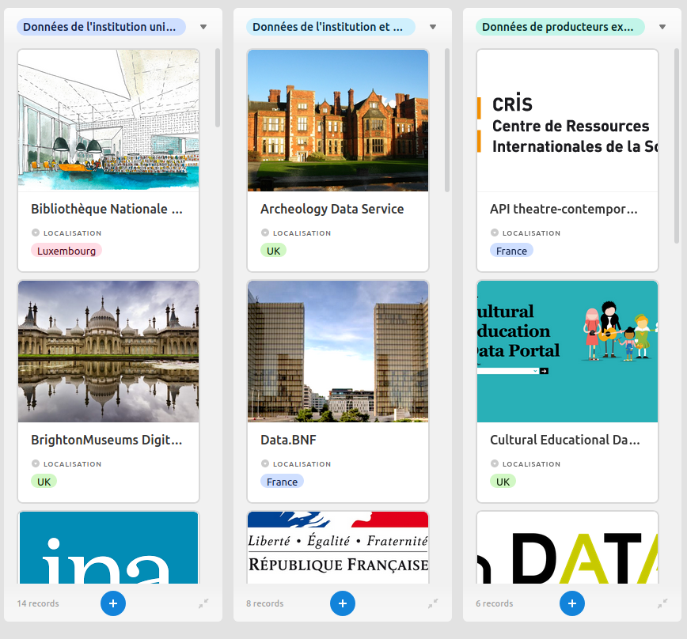
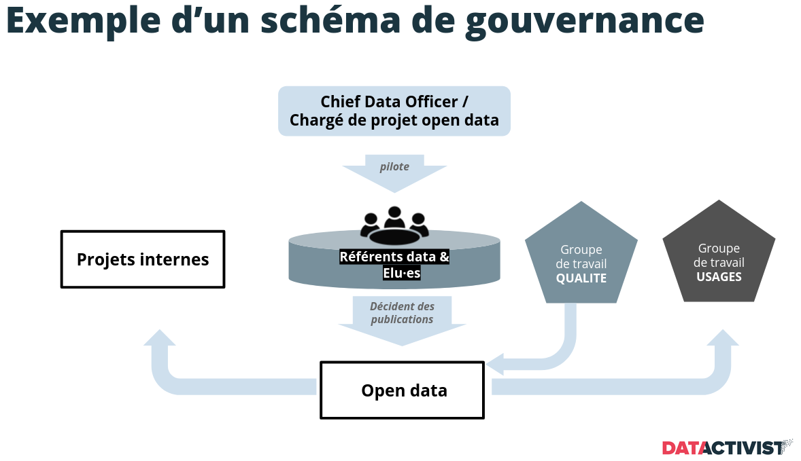

layout: true
  

`r paste0("<div class='my-footer'><span>", params$event, "</span> <center><div class=logo></center></span></div>")` 


---

## Méthodologie : le cycle d'ouverture de la donnée

.pull-left[
Le travail d'un·e chef·fe de projet open data suit les 7 phases résumées par le schéma du [cycle d'ouverture de la donnée]() (ci-contre).

Chaque étape détaille :
* une tâche à accomplir en lien avec la donnée ;
* les acteur·rices mobilisé·es ;
* les missions sous jacentes.

]

.pull-right[

]


---

## Programme

Le programme de ces deux journées consacrées à la gestion de projet open data va s'articuler autour des deux axes transversaux de cette méthodologie :

.pull-left[
#### Journée 1 : les acteurs et actrices

* **Matinée** : constituer son réseau
  * qui est qui et qui fait quoi ?
  * .red[**cartographie du réseau des acteurs et actrices de l'open data local**] ;
* **Après-midi** : animation et veille
  * animer le réseau, de la collecte à la publication ;
  * élaborer une veille des bonnes pratiques ;
  * .red[**cartographie des collectivités à suivre**].
]

.pull-right[
#### Journée 2 : les données
* **Matinée** : identification des données
  * données essentielles, utiles et idéales
  * .red[**cartographie des données de la plateforme**]
* **Après-midi** : les étapes de la publication
  * standards techniques, obligations et conformité
  * .red[**projet de feuille de route open data**]
]


---

background-image: url("https://media.giphy.com/media/7OWvColXObKZc9OPJM/giphy.gif")
class: center, top, inverse

# 1. Acteurs et actrices de l'open data local

---

### Profils identifiés

Les membres du réseaux peuvent se situer au sein de la structure ou à l'extérieur. Dans certains cas, leur fonction sera identifiée : du fait de leur poste (ex. : DSI) ou de leur relation aux données (ex. : délégataire), leur place dans le cycle de vie de la donnée apparaîtra comme évident :

.pull-left[#### en interne

* équipe projet open data ;
* comité de pilotage ;
* élu·es ;
* responsables techniques et légaux (DSI, DPO, etc.)]

.pull-right[#### en externe
* AMO ;
* délégataires ;
* autres administrations.]

---

### Profils à identifier

Mais dans d'autres cas, il s'agira d'identifier les profils à même d'intégrer ce réseau comme personne ressource, soutien ou relais.

.pull-left[#### en interne

* services producteurs ;
* référent·es ;
* personnes ressources.]


.pull-right[#### en externe

* réutilisateur·rices ;
* autres producteur·rices ;
* influenceurs et influenceuses.]


---

### Les référent·es : allié·es de choix !

Les **référent·es** sont les personnes qui, au sein de chaque service, disposent de la connaissance et des leviers pour faciliter la publication de données.

Leurs profils peuvent être très variés :
* une cheffe de service convaincue de l'intérêt de l'open data ;
* un technicien expérimenté, fin connaisseur des rouages de la production de données ;
* une nouvelle arrivante sensible aux enjeux de l'open data et désireuse d'en appliquer les principes à sa direction.

Le **réseau** informel que constituent les référent·es doit vous permettre de couvrir toutes les thématiques et tous les domaines. Il s'agit de savoir, pour chaque sujet, avec qui échanger pour permettre l'exécution de votre feuille de route.

---

### Les producteurs externes

Les producteurs de données externes aux administrations fournissent souvent des données variées et précieuses.

Il est important de connaître votre lien pour savoir l'autorisation que vous avez d'utiliser les données et ce que vous êtes en droit d'exiger :
* pour les délégataires de service public, une **convention** est peut-être en vigueur sur le partage ou la fourniture de données ?
* pour les entreprises ou administrations dont les données recoupent territoire, la **licence** vous permet-elle de les rediffuser voire de les adapter librement ?

Certains producteurs peuvent s'avérer des réutilisateurs prolifiques : PME, universités, associations, etc.

--

Et, pour identifier les producteurs qui pourraient manquer, rien ne vaut .red[**une veille sur les collectivités voisines ou équivalentes**]. Mais ça, nous le verrons cette après-midi !


---

background-image: url("https://media.giphy.com/media/l378jPZA8DVxUhCjS/giphy.gif")
class: center, top, inverse

# 2. Cartographier son réseau


---

background-image: url("https://media.giphy.com/media/X40zUKTGZgp7q/giphy.gif")
class: center, top, inverse

## 2.1 Le réseau interne

---

### Notre outil : Airtable

Nous utiliserons pour les cartographies des réseaux et des données l'outil de gestion de bases de données en ligne .red[**Airtable**].

Il offre de nombreuses fonctionnalités qui nous seront utiles pour ces cartographies, notamment :


.pull-left[#### relier les entitées entre elles


]

.pull-right[#### créer des vues par thème ou filtre



]


---

### Les acteurs et actrices de la gouvernance

La première catégorie d'acteurs et actrices en interne sont les personnes impliquées dans la **gouvernance des données** :



---

### Les services producteurs 1/2

.pull-left[Pour identifier les services producteurs, nous pouvons tout d'abord faire le tour des jeux de données disponibles.

.red[L'interface ODS], comme la plupart des outils, offre différents filtres, dont un filtre par producteur. Il identifie le nombre de jeux de données publiés par chaque entités, ce sera notre première piste.]

.pull-right[

]


---

### Les services producteurs 2/2

.pull-left[

]

.pull-right[
Beaucoup de jeux de données sont rattachés à la *"Ville de La Rochelle"*, sans plus de précision.

Dans ce cas, nous pouvons tenter de retrouver le service producteur en étudiant les catégories et informations dont nous disposons sur les jeux de données.

Nous pouvons croiser ces catégories avec l'organigramme de la ville ou de la communauté d'agglomération pour disposer des intitulés exacts.
]

---

### Les référent·es

Maintenant que nous disposons d'une liste des services producteurs, nous allons pouvoir voir si nous disposons d'un réseau de référent·es.

Pour les personnes connues, nous allons connecter nos jeux de données en ajoutant une colonne avec le nom du ou de la référent·e dans le jeu `producteurs_interne` que nous allons relier au jeu `interlocuteurs_internes`.

Nous pouvons ensuite utiliser une vue de type .red[**Kanban**] pour afficher nos `interlocuteurs_internes` par catégorie et voir ainsi la liste de nos référents.

Nous pouvons aussi créer une colonne supplémentaire pour spécifier si la colonne *référent·e* est renseignée dans le jeu `producteurs_interne` et ainsi disposer de la liste des services où il serait utile de chercher un·e interlocuteur·rice.

---

background-image: url("https://media.giphy.com/media/ej77S1hKG889pmYDbd/giphy.gif")
class: center, top, inverse

## 2.2 Le réseau externe

---

### Les producteurs externes

Nous pouvons utiliser la même démarche d'enquête pour identifier les producteurs et productrices externes de données portant sur la ville ou l'agglomération :


---

### Qui réutilise les données de la ville et de l'agglo ?


---

background-image: url("https://media.giphy.com/media/uM2nSR78R2sgM/giphy.gif")
class: center, top, inverse

# 3. Animer son réseau

---

## 3.1 Animer en interne

L'animation en interne vise plusieurs objectifs dans la feuille de route :
* associer les acteur·rices de l'open data aux décisions pour assurer fluidité et concertation autour de la publication des données ;
* partager les bonnes pratiques pour créer une culture commune de l'open data et aider à faire émerger des idées ;
* identifier les problèmes qui se présentent et les anticiper pour proposer des solutions d'organisation aux services ;
* valoriser le travail d'ouverture et son impact concret en faisant connaître les réutilisations et publications.

A chaque volet peuvent correspondre de multiples actions selon les moyens, les temps et les priorités de la politique open data interne.

Derrière chaque objectif transparaît un des rôles centraux de la/du chef·fe de projet :

--

#### .red[responsable de la sensibilisation à l'open data]

---

### Un discours adapté aux acteurs

Extrait du [Guide de lancement open data](http://www.opendatalab.fr/laboratoire/le-kit-collectivites) de l'[Open data lab](http://www.opendatalab.fr/laboratoire/le-kit-collectivites) d'Occitanie.


---

### Associer à la décision

#### Exemple de méthodologie : la Wanted data list

* *"De quelle donnée a besoin mon service ?"*
* *"Quelles sont les demandes des usager·ères ?"*
* *"De quelles données d'un autre service pourrais-je avoir besoin ?"*
* etc.

Réunissez les membres d'un service autour de ces quelques questions dans le cadre d'un atelier Wanted Data List et établissez avec elles et eux .red[**une liste collaborative des besoins réels**]. Les leurs mais aussi ceux de la société civile ou des autres services ...

D'abord par groupe pour réuni·es pour partager leurs constats, les agent·es auront l'occasion d'envisager l'open data sous un autre angle : celui du service public (pour l'externe) et celui de l'outil métier (pour l'interne).

L'occasion de s'inspirer de [la méthode Dat'Accélère](https://medium.com/datactivist/datacc%C3%A9l%C3%A8re-des-ateliers-et-une-m%C3%A9thodologie-pour-booster-les-projets-avec-les-donn%C3%A9es-9b40776891a4), élaborée par Samuel Goëta chez Datactivist.

---

### Partager les bonnes pratiques

#### Exemple de méthodologie : "les mardis de la donnée"

Du café, quelques viennoiseries, un vidéoprojecteur et un·e invité·e (ou, par temps de Covid, un rendez-vous Zoom ou Skype) :

> *"Bonjour, je m'appelle Séverine et je travaille pour la Communauté d'agglomération du Grand Poitiers sur les questions de données. Je suis venue vous parler de notre projet Data Sandwich pour valoriser notre plateforme d'open data !"*

Sur la base du volontariat, pourquoi ne pas organiser un rendez-vous mensuel pour rencontrer un·e acteur·rice de l'open data, que ce soit côté réutilisation ou côté production, en interne ou en externe. En temps limité, avec une présentation partagée par la suite et une séance de question réponse, vous vous assurerez que, une fois par mois, la donnée est un sujet de discussion entre les services dans un cadre convivial.

---

### Identifier les problèmes

#### Exemple de méthodologie : une liste collaborative des problèmes

* *"J'ai un soucis sur l'API parking toutes les semaines à la même heure."* ;
* *"Je n'arrive plus à retrouver les subventions aux associations, on pourrait créer un tag ?"* ;
* *"Est-ce qu'il existe des données de qualité de l'air sur le Sud de l'agglo ?"*

Plutôt que de transformer votre boîte mail en service après-vente de la politique d'open data, pourquoi ne pas ouvrir une page pour recueillir les besoins et miser sur l'intelligence collective ?

Un forum bien configuré peut aider à centraliser les questions (qu'elles soient techniques, juridiques ou pratiques) et à éviter les doublons. Pourquoi ne pas s'inspirer de [#TeamOpenData](teamopendata.org/) et de son interface basée sur le logiciel open source de forum [Discourse](https://www.discourse.org/) ?

C'est aussi un puissant outil d'identification de besoin de formation et de recrutement des participant·es pour d'autres actions d'animation interne !

---

## 3.2 Animer en externe

---

### Communiquer au bon moment, au bon endroit


---

### Evénementialiser l'ouverture des données

.pull-left[#### Hackathon, l'événement (même confiné !)

Ex. : [Hackathon Amif en ligne (décembre 2020)](https://www.linkedin.com/posts/alexandrebousez_collaboratif-hackathonamif-activity-6740225496530919425-WSia/))


]


.pull-right[#### Hackaviz, le concours (et ses récompenses !)
Ex. : [Hackaviz Toulouse 2020 (mai 2020)](http://toulouse-dataviz.fr/hackaviz-2020)


]


---

background-image: url("https://media.giphy.com/media/4Z7gq2jdrFg1II1P0g/giphy.gif")
class: center, top, inverse

# 4. Une veille des bonnes pratiques

---

background-image: url("https://media.giphy.com/media/VhK5Wmso8LJAWreQdZ/giphy.gif")
class: center, top, inverse


## 4.1 Outils et espaces de veille

---

### Sur les réseaux sociaux

.pull-left[#### Sur LinkedIn

* suivez les comptes des influenceur·ses techs, open-data, collectivités ;
* jetez un oeil aux tags ;
* allez voir du côté des pages suggérées.

Ici, [un post du compte d'Atmo Auvergne-Rhône-Alpes](https://www.linkedin.com/posts/atmo-rh-ne-alpes_qualit%C3%A9-de-lair-dans-le-m%C3%A9tro-lyonnais-activity-6739194249809555456-qqsU/) :


]

.pull-right[#### Sur Twitter

* créez-vous des listes ;
* repérez les hashatags pertinents ;
* relayez les initiatives intéressantes pour suivre leur actu.

Ici, l'annonce du hackaviz [organisé par Grand Poitiers](https://twitter.com/Grand_Poitiers/status/1184423931974946816).


]

---

### Dans les médias spécialisés ...

#### ... collectivités

Sujet qui recoupe les rubriques juridiques, développement économique, organisation des services et communication, l'open data occupe une place grandissante dans les médias à destination des agent·es des collectivités.

Au delà de l'incontournable [Gazette des communes](https://www.lagazettedescommunes.com/themes/open-data/), qui consacre des articles nombreux et fouillés au sujet, jetez un oeil aux plus publications plus récentes comme le duo de lettres spécialisées [ComPol / Courrier Cab](https://www.courriercab.com/), destinées aux décideurs en politiques publiques.


---

### Dans les médias spécialisés ...

#### ... tech

L'open data est aussi une préoccupation pour le secteur de la tech : qu'il s'agisse du côté militant ou du côté entrepreneurial, les titres spécialisés produisent une veille et des papiers de fonds réguliers sur la législation, les débats et les initiatives.

Parmi les pure players, citons deux titres de référence :
* [nextImpact](https://www.nextinpact.com/), et notamment son rédacteur en chef [Marc Rees](https://twitter.com/reesmarc), propose un suivi exigeant et en profondeur de l'évolution de la législation, du lobbying et des débats autour des sujets d'open data ;
* [Numerama](https://www.numerama.com/tag/open-data/) publie régulièrement des enquêtes et articles de synthèse sur les débats politiques et économiques autour de ce sujet ;
* sans oublier [ZDnet](https://www.zdnet.com/) et autres ou les rubriques techs des médias de référence.


---

background-image: url("https://media.giphy.com/media/xT9IgsTMqIWwi21XWM/giphy.gif")
class: center, top, inverse


## 4.2 Qui sont les producteurs d'open data en Nouvelle Aqutaine ?

---

### Plusieurs catégories de producteurs

* **les collectivités territoriales concernées par la LRN** : communes, agglomérations, métropoles, départements, région et EPCI regroupant plus de 3500 habitant·es et employant plus de 49 agent·es ;
* **les administrations nationales couvrant la région** : soit depuis ailleurs, soit disposant d'une antenne locale (Ademe, Insee, Direccte, etc.) ;
* **les entreprises couvrant ou implantées dans la région** : tel que l'opérateur du réseau électrique Enedis ou EDF ;
* **les antennes d'ONGs ou associations nationales** : comme Atmo Nouvelle Aquitaine, Association de surveillance de la qualité de l'air agréée membre du réseau Atmo France.

---

### Cartographie 1 : les collectivités ouvertes en Nouvelle Aquitaine

```{r carte_collterr_NA}

```

---

#### Ressources

1. la liste complète des collectivités territoriales (établie à partir de la base [OpenDataSoft pour les communes](https://public.opendatasoft.com/explore/dataset/contours-geographiques-simplifies-des-communes-2019/table/) et du [recensement de collectivités territoriales.gouv.fr](https://www.collectivites-locales.gouv.fr/liste-et-composition-2019-0)) ;
2. la liste des collectivités ouvertes publiées par l'Observatoire des collectivités territoriales d'OpenDataFrance, [éditions octobre 2020](https://www.data.gouv.fr/fr/datasets/donnees-de-lobservatoire-open-data-des-territoires-edition-2020-1/), également disponible [au format Airtable](https://airtable.com/shrKrV6KY7BlhHDx7/tblt8JGHVJnYRCSeA/viw769tfpzuEYQaQI) ;
3. la recension des plateformes territoriales de l'open data réalisée par nos soins [sur Airtable également](https://airtable.com/shrmZOh5If14Q1PVN/tblwklJPsyayeH5lX).


---

background-image: url("https://media.giphy.com/media/xT9IgsTMqIWwi21XWM/giphy.gif")
class: center, top, inverse


## 4.2 Quelles sont les collectivités comparables à LR ?


---
class: inverse, center, middle

# Merci !

Contact : [sylvain@datactivist.coop](mailto:sylvain@datactivist.coop)
