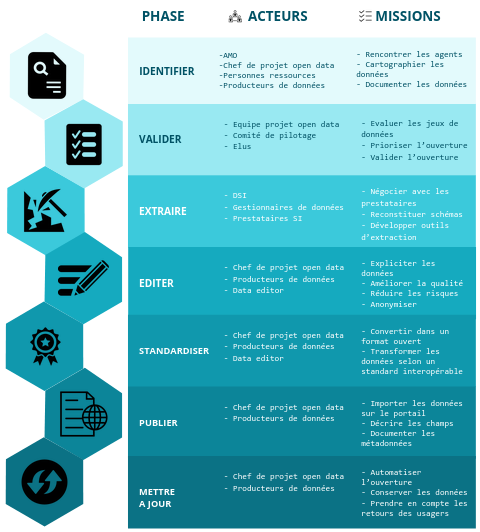

layout: true
  

`r paste0("
", params$event, " 

")` 

---

background-image: url("https://media.giphy.com/media/Kx7HO28xRu1cG8S3GB/giphy.gif")
class: center, top, inverse

# Cartographies de données

---

## 1. Usage de la cartographie de données

Nous allons utiliser la .red[**cartographie de données**] pour identifier trois typologies de jeux de données qui serviront à établir notre feuille de route open data :
1. les données **disponibles et publiées** ;
2. les données **disponibles mais non publiées** : il s'agit des données identifiées auprès des services comme existantes mais qui n'ont pas fait l'objet d'une publication ;
3. les données **non disponibles mais présentant un intérêt à la publication**.

Dans les deux premiers cas, notre démarche va consister à dresser une liste la plus exhaustive possible en s'appuyant sur la documentation disponible et en sollicitant les services producteurs de données.

Pour le troisième cas, il nous faudra trouver des sources permettant d'établir une liste de données obligatoires et/ou *utiles*, en consultant la réglementation ou en collectant les bonnes pratiques auprès des autres acteurs.

---

### Les données obligatoires

---

### Les bonnes pratiques

.pull-left[#### Le SCDL (ODF)

Le *[Socle commun des données locales](https://scdl.opendatafrance.net/docs/)* élaboré par OpenDataFrance constitue une liste de jeux de données jugés essentiels produits par les acteurs territoriaux.

En plus d'offrir une liste de jeux de données, ce projet propose également des schémas permettant de standardiser la publication de ces jeux de données et ainsi de faciliter leur réutilisation et leur interopérabilité.
]

.pull-right[#### Le recensement des données de 16 municipalités (Datactivist)

Entre avril et septembre 2017, Timothée Gidoin a constitué [un répertoire de 400 jeux de données](https://medium.com/datactivist/qui-a-ouvert-quoi-le-recensement-des-donn%C3%A9es-des-villes-est-maintenant-ouvert-b7f697135c1f) en s'appuyant sur ceux partagés par 16 des 20 plus grandes villes de France et 2 villes moyennes à la politique d'open data avancée.

Outre la liste complète, cette étude propose des focus thématiques :
* jeux les plus publiés ;
* qualité de la documentation ;
* modalité de contribution / échange avec le public.
]

---

background-image: url("img/swot_analysis.png")
class: center, top, inverse

## 2. Evaluer le rapport coût / bénéfice de l'ouverture

---

### Une matrice d'évaluation du coût : le data pipeline

.pull-left[

]

.pull-right[Nous proposons un système de notaton basé sur .red[**l'open data pipeline**] détaillant le cycle d'ouverture de la donnée.

Pour chaque jeu de données, nous noterons le "coût" d'ouverture :
* sur 2 pour l'identification ;
* sur 3 pour les autres critères.

Chaque note constitue une estimation du **temps** x **le travail** nécessaire à assurer cette tâche.

Nous obtiendrons ainsi une note sur vingt.]

---

### Une matrice d'évaluation de l'opportunité

Nous proposons d'évaluer l'opportunité suivant quatre critères. Il est important de noter que chaque critère est subjectif et évolutif : contrairement à la note de *"coût"*, il apparaît nécessaire d'argumenter les notes. A fortiori pour pouvoir soumettre ces notations à 

* **préparation** : niveau de disponibilité pratique de la donnée. Le service est-il équipé ? Disponible ? Sensibilisé ? Engagé ? Plus c'est le cas, plus nous considérerons que le niveau de préparation est élevé.
* **agenda** : intérêt conjoncturel de la publication. Il peut s'agir d'un chantier interne, d'un plan local, d'une priorité régionale, d'un partenariat ou de la sortie d'un nouvel indicateur.
* **usage interne** : potentiel de réutilisation par les services. Parce que les premiers à réutiliser l'open data, ce sont vos services !
* **usage public** : potentiel de réutilisaiton par les services.

---

background-image: url("https://media.giphy.com/media/l3JDlSarfrxnje0yA/giphy.gif")
class: center, top, inverse

### C'est l'heure de sortir les post-its !

---

background-image: url("")
class: center, top

### Nous collerons le résultat ici

---

## 3. Priorisation et programmation

---

background-image: url("")
class: center, top, inverse

# La construction de la feuille de route

---

## Les étapes clefs

1. **.red[Mise à l'agenda politique]** Avant d'engager la réflexion, assurez-vous d'avoir un feuille de route clair : calendrier, priorité et objectifs.

--

2. **.red[Intelligence collective]** Sondez les différents services, métiers et responsables pour avoir une vision claire des attentes et des possibilités en terme de donneés avec des entretiens et des ateliers ouverts aux services ou aux territoires.

--

3. **.red[Validation technique]** Soumettez les grands axes directeurs aux directeur·rices techniques pour obtenir leur aval ;

--

4. **.red[Copil]** Présentez la synthèse validée au copil avant de le soumettre à la validation politique ;

--

5. **.red[Délibération]** Accompagnez la proposition vers le vote de la décision politique.

---
class: inverse, center, middle

# Merci !

Contact : [sylvain@datactivist.coop](mailto:sylvain@datactivist.coop)
